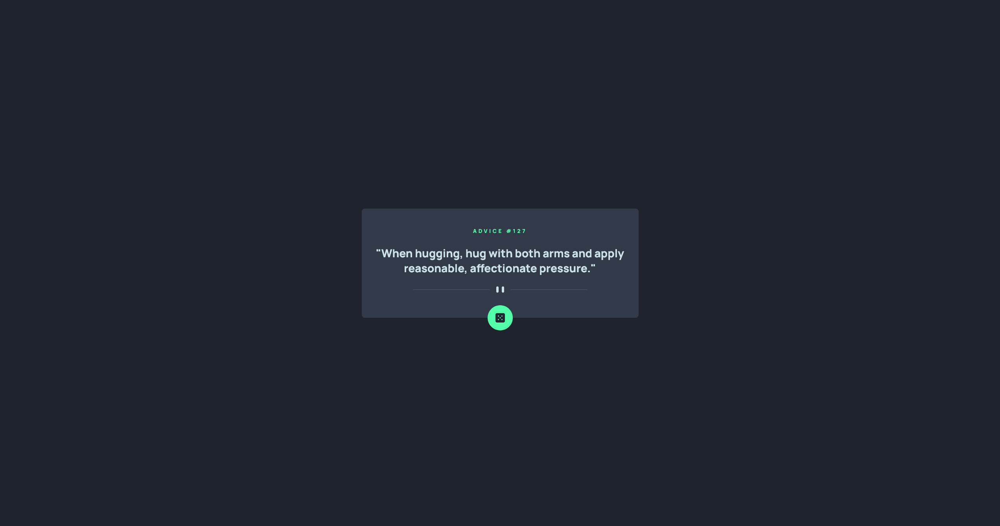

# Frontend Mentor - Advice generator app solution

This is a solution to the [Advice generator app challenge on Frontend Mentor](https://www.frontendmentor.io/challenges/advice-generator-app-QdUG-13db). Frontend Mentor challenges help you improve your coding skills by building realistic projects.

## Table of contents

- [Overview](#overview)
  - [The challenge](#the-challenge)
  - [Screenshot](#screenshot)
  - [Links](#links)
- [My process](#my-process)
  - [Built with](#built-with)
  - [What I learned](#what-i-learned)
  - [Continued development](#continued-development)
  - [Useful resources](#useful-resources)
- [Author](#author)
- [Acknowledgments](#acknowledgments)

**Note: Delete this note and update the table of contents based on what sections you keep.**

## Overview

### The challenge

Users should be able to:

-

### Screenshot



### Links

- Solution URL: [Add solution URL here](https://www.frontendmentor.io/solutions/advice-generator-using-vanilla-js-html-css-5LdUfJcPb)
- Live Site URL: [Add live site URL here](https://frontendmentor-advice-generator.vercel.app/)

## My process

### Built with

- Semantic HTML5 markup
- CSS custom properties
- Flexbox
- CSS Grid
- Mobile-first workflow

### What I learned

I got some practice in using vanilla JS again after switching to a React and Angular focused workflow. It was a good challenge to practice data fetching and rendering without dynamic state tools offered in those frameworks. I got a bit more practice using CSS custom properties and shadow effects using drop shadows.

I chose to render a new card using only Javascript and insert it dynamically after the data was fetched. The shuffle button initiates a page refresh which fetches and renders a new card. In React or Angular I would have set this up as a Single Page Application and used state to rerender the card when data was fetched.

Some examples:

```css
.proud-of-this-css {
  --color-neon-green: hsl(150, 100%, 66%);
  filter: drop-shadow(0 0 0.75rem var(--color-neon-green));
}
```

```js
async function renderAdvice() {
  const res = await getAdvice();
  const { id, advice } = res;

  const adviceId = document.createElement("h1");
  adviceId.id = "advice-id";
  adviceId.innerText = `Advice #${id}`;

  const adviceText = document.createElement("p");
  adviceText.id = "advice-text";
  adviceText.innerText = `"${advice}"`;

  const divider = document.createElement("img");
  if (screen.width >= 1920) {
    divider.src = "./images/pattern-divider-desktop.svg";
  } else {
    divider.src = "./images/pattern-divider-mobile.svg";
  }

  const shuffleBtn = document.createElement("button");
  shuffleBtn.id = "shuffle-btn";
  shuffleBtn.addEventListener("click", () => location.reload());

  const diceIcon = document.createElement("img");
  diceIcon.src = "./images/icon-dice.svg";

  adviceCard.prepend(adviceId);
  adviceCard.append(adviceText);
  adviceCard.append(divider);
  adviceCard.append(shuffleBtn);
  shuffleBtn.append(diceIcon);
  main.append(adviceCard);
}
```

### Continued development

I would like to get more practice in Vanilla JS. Managing state and rendering fetched data wasn't as intuitive as in React or Angular for me. I switched to using frameworks very early in my education and didn't practice dynamically fetching data and rendering it to the screen in Vanilla JS. I want to put more time into understanding the fundamentals so the advantages of a framework will be better understood.

### Useful resources

The only resource I really used for this challenge was [MDN](https://developer.mozilla.org/en-US/) to lookup Javascript concepts.

## Author

- Frontend Mentor - [@j-dsmith](https://www.frontendmentor.io/profile/j-dsmith)
